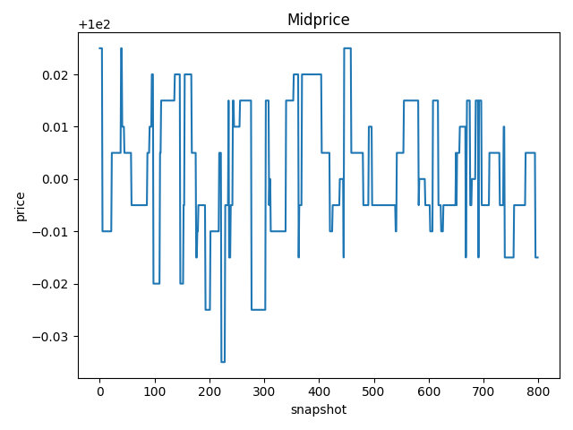
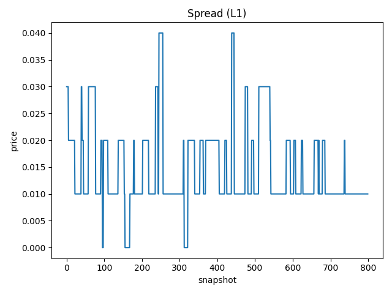
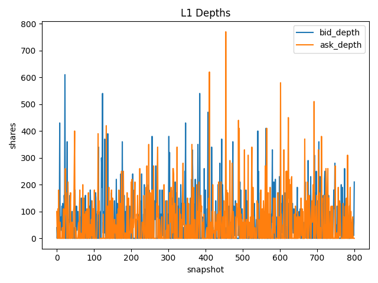
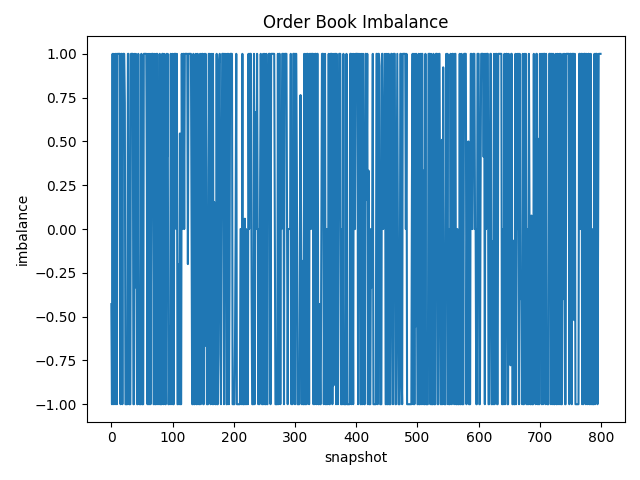
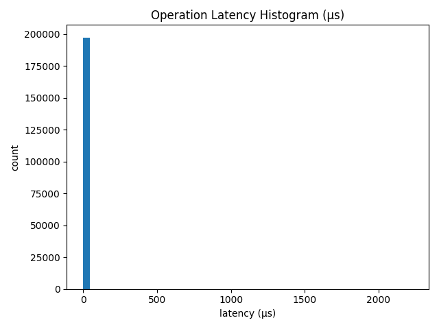

# Order Book Simulator

A production-grade **price-time priority matching engine** built in Python. Simulates a financial exchange order book with limit/market orders, partial fills, cancels, replace/modify, IOC/FOK, deterministic synthetic event generation, L1 metrics, nanosecond-precision benchmarks, and interactive visualizations.

**Author:** [Sohan Shingade](https://github.com/sohan-shingade) — UC San Diego (Data Science & Finance)

---

## Highlights

- **Strict Price-Time Priority** with FIFO matching at each price level
- **O(1) best-price discovery** via lazy-deletion heaps
- **~390,000 ops/sec** with p50 latency ~2 us on commodity hardware
- **Deterministic & reproducible** — fixed seeds produce identical runs
- **Zero external dependencies** — fully self-contained, no market data feeds required
- **Property-based testing** with Hypothesis for invariant validation

---

## Sample Output

<p align="center">
  
  
</p>
<p align="center">
  
  
</p>
<p align="center">
  
</p>

---

## Quickstart

```bash
# Clone
git clone https://github.com/sohan-shingade/orderbook-simulator.git
cd orderbook-simulator

# Install
pip install -r requirements.txt

# Run tests
make test

# Run a full simulation (200k events)
python -m orderbook.cli sim --seed 30 --n-events 200000 --report results/

# Run microbenchmark (300k events)
python -m orderbook.cli bench --n-events 300000 --report results/
```

Results are saved to `results/` — CSVs for trades, snapshots, and latencies, plus PNG visualizations in `results/figures/`.

---

## Features

### Order Types & Execution Rules

| Feature | Details |
|---|---|
| **Order Types** | Limit (rests on book), Market (immediate execution) |
| **Time-in-Force** | GTC (good-til-cancel), IOC (immediate-or-cancel), FOK (fill-or-kill) |
| **Partial Fills** | Orders can be partially filled; remainder rests or cancels based on TIF |
| **Cancel** | Remove any resting order by ID |
| **Replace/Modify** | Change price, quantity, or TIF — price changes reset queue priority |

### Matching Engine

The core engine (`orderbook/core.py`) implements a continuous double auction with strict price-time priority:

- **Price Priority** — better prices execute first
- **Time Priority** — at the same price, earlier orders (FIFO) execute first
- **Deterministic Sequencing** — monotonic integer timestamps ensure reproducibility

**Data structures:**
| Structure | Purpose | Complexity |
|---|---|---|
| `dict[price, deque[Order]]` | FIFO queue per price level | O(1) append/match |
| Min/max heaps with lazy deletion | Best-price discovery | O(1) amortized |
| `dict[order_id, (side, price)]` | Order location index | O(1) lookup |

### Synthetic Event Generator

Configurable event generator (`orderbook/sim.py`) producing realistic market activity:

- **65% limit orders** — placed around the midprice with configurable volatility
- **20% market orders** — immediate execution against resting liquidity
- **10% cancellations** — random resting order removal
- **5% replacements** — price shifts of +/- 1 tick
- Log-normal order sizes, configurable drift, and initial book seeding

### L1 Metrics

Computed from periodic snapshots (`orderbook/metrics.py`):

- **Spread** — best ask minus best bid (liquidity measure)
- **Midprice** — (best ask + best bid) / 2 (fair value proxy)
- **Bid/Ask Depth** — total quantity at best price levels
- **Imbalance** — (bid_depth - ask_depth) / (bid_depth + ask_depth), ranging from -1 to +1

### Latency Benchmarking

Every operation is timed with `time.perf_counter_ns()`:

| Percentile | Latency |
|---|---|
| p50 | ~2 us |
| p90 | ~4 us |
| p99 | ~7 us |
| **Throughput** | **~390k ops/sec** |

---

## CLI Reference

```bash
# Full simulation with all outputs
python -m orderbook.cli sim [OPTIONS] --report results/

# Microbenchmark (latency-only, no trade output)
python -m orderbook.cli bench [OPTIONS] --report results/

# Update docs with latest figure paths
python -m orderbook.cli report --report results/
```

### Simulation Parameters

| Flag | Default | Description |
|---|---|---|
| `--seed` | 30 | Random seed for reproducibility |
| `--n-events` | 50000 | Number of events to simulate |
| `--tick` | 0.01 | Minimum price increment |
| `--p-limit` | 0.65 | Probability of limit order |
| `--p-market` | 0.20 | Probability of market order |
| `--p-cancel` | 0.10 | Probability of cancellation |
| `--p-replace` | 0.05 | Probability of replacement |
| `--mid` | 100.0 | Initial midprice |
| `--sigma-ticks` | 1.5 | Price placement volatility (in ticks) |
| `--drift-per-1k` | 0.0 | Price drift per 1000 events |
| `--size-mean` | 100.0 | Mean order size (log-normal) |
| `--size-min` | 10 | Minimum order size |
| `--p-ioc` | 0.05 | IOC probability on limit orders |
| `--p-fok` | 0.02 | FOK probability on limit orders |
| `--snapshot-every` | 250 | L1 snapshot frequency |

---

## Output Artifacts

| File | Contents |
|---|---|
| `trades_*.csv` | maker_id, taker_id, price, qty, timestamp |
| `snapshots_*.csv` | event, best_bid, best_ask, bid_depth, ask_depth |
| `latencies_*.csv` | latency_ns per operation |
| `figures/spread.png` | Bid-ask spread over time |
| `figures/midprice.png` | Midprice evolution |
| `figures/depths.png` | Bid vs ask depth |
| `figures/imbalance.png` | Order book imbalance |
| `figures/latency_hist.png` | Operation latency distribution |

---

## Interactive Notebooks

Two Jupyter notebooks are included in `notebooks/`:

- **`OrderBook_Simulator_Report.ipynb`** — End-to-end walkthrough with inline plots
- **`OrderBook_Interactive_Report.ipynb`** — Interactive parameter sliders (seed, event count, probabilities, volatility) with live Plotly charts

```bash
pip install plotly ipywidgets
jupyter lab notebooks/
```

See `docs/OrderBook_Simulator_Report_example.pdf` for example output.

---

## Project Structure

```
orderbook-simulator/
├── orderbook/
│   ├── __init__.py          # Package exports
│   ├── models.py            # Order, Trade, Side, OrderType, TimeInForce
│   ├── core.py              # OrderBook matching engine
│   ├── sim.py               # Synthetic event generator
│   ├── metrics.py           # L1 metrics computation
│   ├── viz.py               # Matplotlib visualizations
│   └── cli.py               # Command-line interface
├── tests/
│   ├── test_core_unit.py    # Unit tests (partial fills, IOC, FOK, cancel, replace)
│   ├── test_properties.py   # Property-based tests (Hypothesis)
│   └── test_metrics.py      # Metrics validation
├── notebooks/               # Jupyter notebooks (static + interactive)
├── docs/                    # Architecture, runbook, example PDF
├── bench/                   # Benchmark runner
├── Makefile                 # Dev shortcuts (setup, test, lint, format, bench)
├── pyproject.toml           # Build config & tool settings
└── requirements.txt         # Dependencies
```

---

## Development

```bash
# Install dev dependencies
pip install -e ".[dev]"

# Format
make format

# Lint + type check
make lint

# Test
make test

# Benchmark
make bench

# Full report (sim + doc update)
make report
```

**Code quality:** Black (formatting), Ruff (linting), MyPy strict mode (type checking)

---

## Tech Stack

| Component | Tool |
|---|---|
| Language | Python 3.11+ |
| Data | NumPy, Pandas |
| Visualization | Matplotlib, Plotly (notebooks) |
| Testing | pytest, Hypothesis |
| Type Checking | MyPy (strict) |
| Linting | Ruff |
| Formatting | Black |

---

## License

MIT
